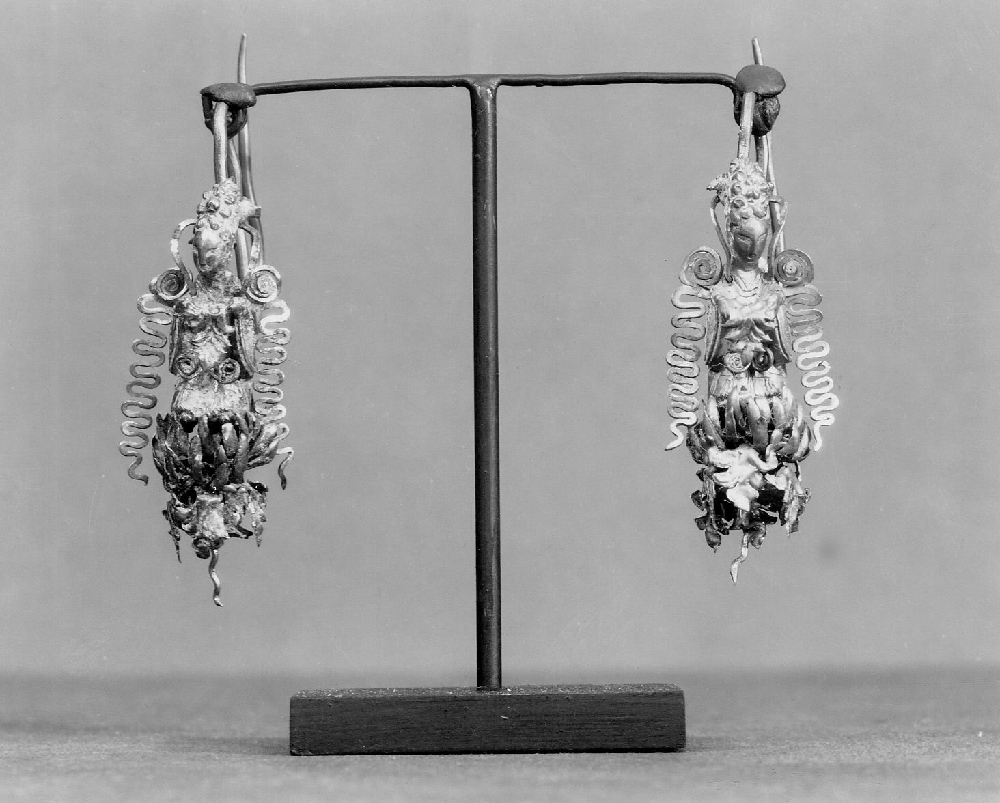

# Tang Dynasty Gold Earrings(Tang China)

Tang Dynasty earrigns (7th-9th centuries CE) are examples of the multiculturalism that characterized medieval China. When it was at it's peak in trading along the Silk Road, the Tang Dynasty extended its influence politically and economically. Their capitals also served as hubs from international commerce. 

Tang earrings frequently uses design elements that were origianted outside of China, including things like looped shapes with gemstones. These are mainly associated with Central Asian and Persian craftsmanship. While these styles show the extent of how  foreign influences shaped Chinese artistic production during this period.

## 
{% include images/
class="right"
width="48%"
caption="Silla gold earrings with danfling ornaments from the SIlla Kingdom. [Source](https://www.metmuseum.org/art/collection/search/60826)"
image-path="images/!(china.jpg)"
%}

## Trade Networks
Luxury items includings gold, silver, and precious stones were often traded along the Silk Road to reach China. Once these resources were obtained, they would be crafted ino=to these objects to be worn by many high status individuals in the Chinese court.

Jeweley represented a tangible link between China and the rest of the world, through which the conutry showcased it's international presence we know today.[^randomthing]

[^randomthing]:Put your source information here.

Lorem ipsum dolor sit amet, consectetur adipiscing elit. Vivamus pretium, nibh vel posuere pretium, neque ipsum maximus libero, ac maximus quam ante sit amet dolor. Integer pharetra semper sem sed sagittis. Curabitur mauris tortor, elementum non felis id, hendrerit efficitur metus.

Sed efficitur leo in magna pretium, euismod malesuada risus interdum. Proin sed libero et enim pulvinar convallis non eget est. Sed ultrices dui vitae enim semper accumsan.[^anotherrandomthing]

[^anotherrandomthing]:Put your next footnote source information here.

## Significance
By examining Tang Dynasty earrings, we are provided with an understanding of how a civilization that actively exchanged cultures could influence art and even business. 

## Pull Quotes Add Emphasis
Pellentesque viverra hendrerit sapien eu consequat. Curabitur leo ante, vestibulum a tincidunt eget, placerat eu nunc. Donec ut sem mi. Vivamus commodo nec sem eget pretium. Nulla ullamcorper volutpat venenatis.



The pull quote you just saw is created with a simple `include` command in Markdown. It's one of many reusable components in Xanthan. You can put important quotes, key statistics, or memorable phrases in these boxes to create visual interest and emphasize crucial points.

Duis eros odio, fringilla et pulvinar vitae, eleifend quis elit. Sed eleifend lectus in bibendum elementum. Vivamus ut velit dignissim, cursus libero nec, commodo orci. Morbi lacus metus, posuere ut pretium ac, malesuada id ligula. Lorem ipsum dolor sit amet, consectetur adipiscing elit. Sed consequat, lacus id blandit ornare, mi nisi rutrum ante, vitae dignissim mauris nisl mattis nisl.

## Images Can Be Different Widths
{% include images/figure.html class="right" width="60%" caption="This image is set to 60% width instead of 48%, giving it more prominence. You can adjust image widths to suit your content. [Source](https://en.wikipedia.org/wiki/File:Eastern_Han_ingot_imprints_with_barbarous_Greek_inscriptions.jpg)" image-path="images/han-coin-two-sides-blushwood.png" %}

The image to the right is **wider than the previous one** (60% instead of 48%). You control this with the `width` parameter in the image code. Want a small image? Use 30%. Want something that dominates? Try 70%.

Images can also be left-aligned (use `class="left"`) or centered full-width (we'll show that in more advanced essays). For Seedling level, right-aligned images at 48-60% width work well for most purposes.

Duis vehicula erat et diam pharetra iaculis. Etiam rutrum scelerisque nunc, ut interdum justo pellentesque sit amet. Vivamus cursus massa mauris, a finibus felis laoreet quis. Integer vel molestie neque.

---

## Bibliography

- Schafer, Edward H. The Golden Peaches of Samarkand. Berkeley: University of California Press, 1963.
- Hansen, Valerie. The Open Empire: A History of China to 1600. New York: W.W. Norton, 2000.